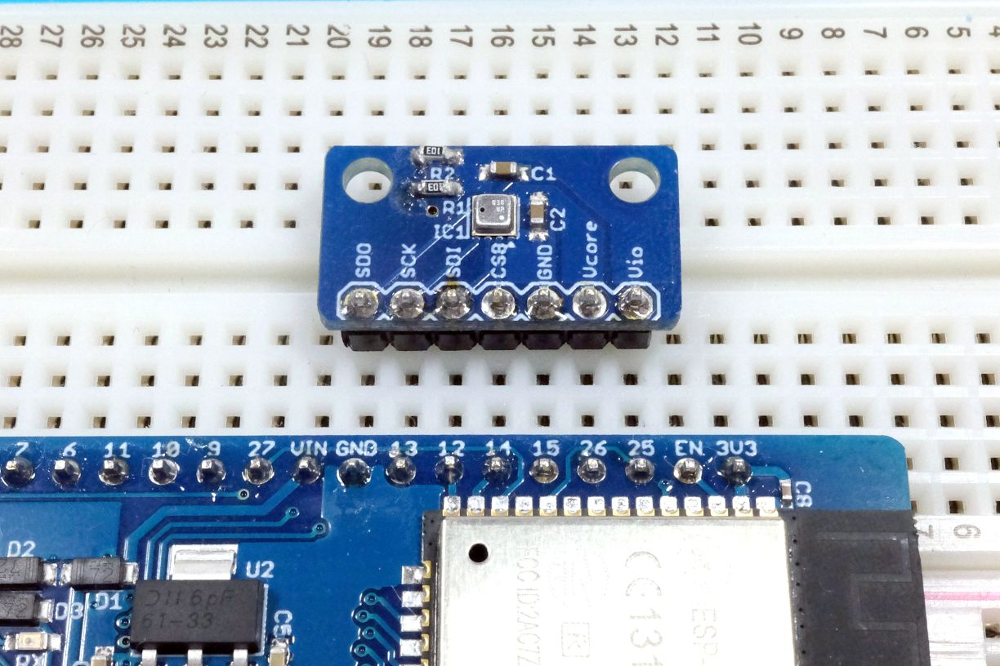

# ESPr® Developer 32 向けI2C通信サンプルスケッチ

ESPr Developer 32上でI2C通信をするサンプルスケッチ。ピンマトリクス機能を使うことでブレッドボード上での配線で完結します。


使い方
----

 + 本スケッチを書き込む

 + 一度書き込んだあとに以下のように液晶と[BME280搭載　温湿度・気圧センサモジュール](https://www.switch-science.com/catalog/2236/)を接続する
   
   + 一度ピン設定を書き込まない場合、液晶モジュールに逆電圧がかかり破損の可能性があります

 + 開発ボードをリセットする

説明
----

 ESP32にはIOマトリクス機能という、SPIやI<sup>2</sup>C通信用のピンを自由に設定できる機能があります。本スケッチは、そのマトリックス機能を利用して、SPI通信を任意のピンにリマップすることで、ジャンパワイヤなしに温度センサーとの通信を行うというデモです。

動作例:
```
/////
TEMP : 31.74 DegC 
PRESS : 998.35 hPa  
HUM : 39.47
/////
TEMP : 31.74 DegC 
PRESS : 998.35 hPa  
HUM : 39.28
/////
TEMP : 31.75 DegC 
PRESS : 998.41 hPa  
HUM : 39.24
/////
TEMP : 31.74 DegC 
PRESS : 998.41 hPa  
HUM : 39.42
/////
TEMP : 31.74 DegC 
PRESS : 998.38 hPa  
HUM : 39.47
```

 注意: デバッグログの出力設定であるGPIO15をGNDとして使うため、シリアルにデバッグログが流れなくなります。

関連情報
----

 1. [ESP-WROOM-32に関するTIPS](http://trac.switch-science.com/wiki/esp32_tips)

 2. [ESPr® Developer 32](https://www.switch-science.com/catalog/3210/)

 3. [BME280搭載　温湿度・気圧センサモジュール](https://www.switch-science.com/catalog/2236/)