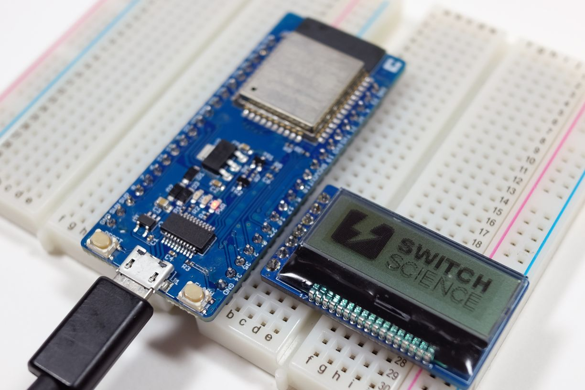
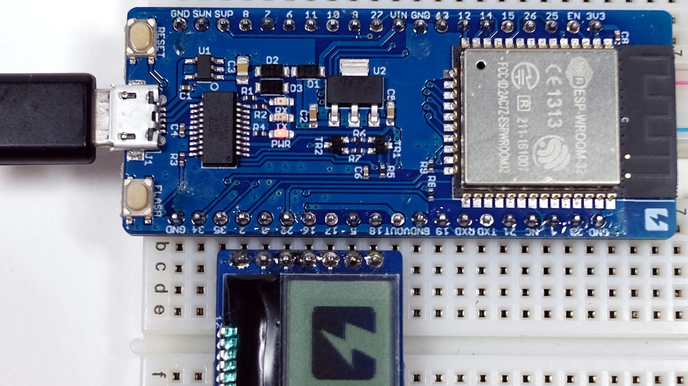

# ESPr® Developer 32 向けSPI通信サンプルスケッチ

ESPr Developer 32上でSPI通信をするサンプルスケッチ。ピンマトリクス機能を使うことでブレッドボード上での配線で完結します。

使い方
----

 + [AQM1248A Simple Library](https://github.com/SWITCHSCIENCE/samplecodes/tree/master/AQM1248A_breakout/Arduino/AQM1248A_lib)を導入する

 + 本スケッチを書き込む

 + 一度書き込んだあとに以下のように液晶と開発ボードを接続する
   
   + 一度ピン設定を書き込まない場合、液晶モジュールに逆電圧がかかり破損の可能性があります

 + 開発ボードをリセットする

説明
----

 ESP32にはIOマトリクス機能という、SPIやI2C通信用のピンを自由に設定できる機能があります。本スケッチは、そのマトリックス機能を利用して、SPI通信を任意のピンにリマップすることで、ジャンパワイヤなしに液晶モージュールとの通信を行うというデモです。

関連情報
----

 1. [ESP-WROOM-32に関するTIPS](http://trac.switch-science.com/wiki/esp32_tips)

 2. [ESPr® Developer 32](https://www.switch-science.com/catalog/3210/)

 3. [AQM1248A小型グラフィック液晶ボード](https://www.switch-science.com/catalog/2608/)
