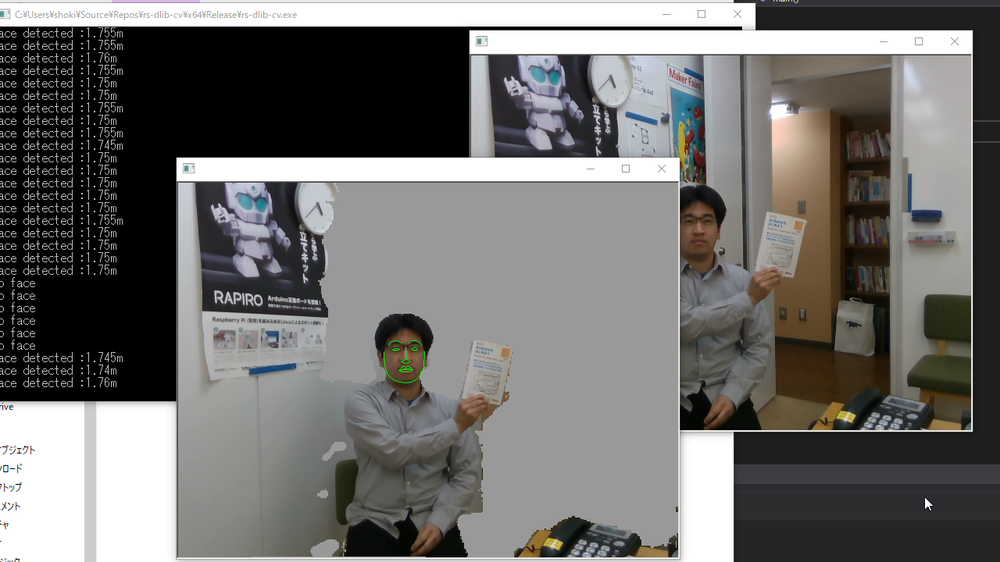

# RealSense SDK 2.0 demo with Dlib and OpenCV

### What is this?

* This is the sample program for RealSense SDK 2.0 with linking Dlib and OpenCV.
* Getting Depth and Color image stream from RealSense devices, detecting faces by Dlib and showing image processing result.

### Expected results

* Green lines are the feature point of faces which used in Dlib face-detector.
* RealSense device measure the length between camera and face, and delete the background of detected face.

### Dependency

* [OpenCV](https://opencv.org/)
* [Dlib](http://dlib.net/)
* [RealSense SDK 2.0](https://github.com/IntelRealSense/librealsense)

### Related information

* [Switch Science blog](http://mag.switch-science.com/)
* [Intel RealSense Depth Camera D435 - スイッチサイエンス](https://www.switch-science.com/catalog/3633/)
* [インテル® RealSense™ カメラ](https://www.intel.co.jp/content/www/jp/ja/support/products/85364/emerging-technologies/intel-realsense-technology/intel-realsense-cameras.html)
